# Architecture diagrams

Companion to `SPEC.md`. Diagrams only; every claim they carry is also stated in the kernel or another companion.

## System shape

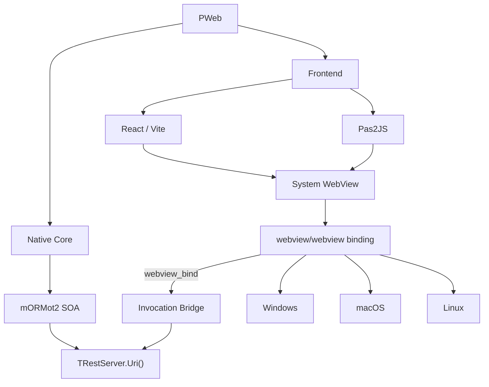

## Asset store

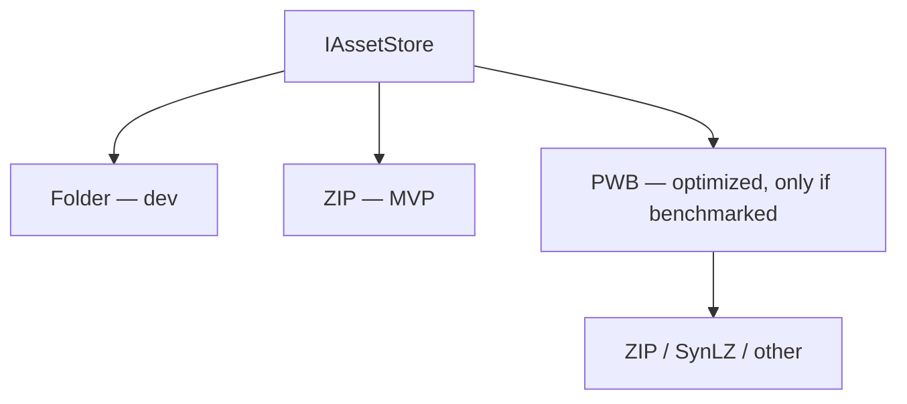

## What the frozen abstractions buy (Phase 0)

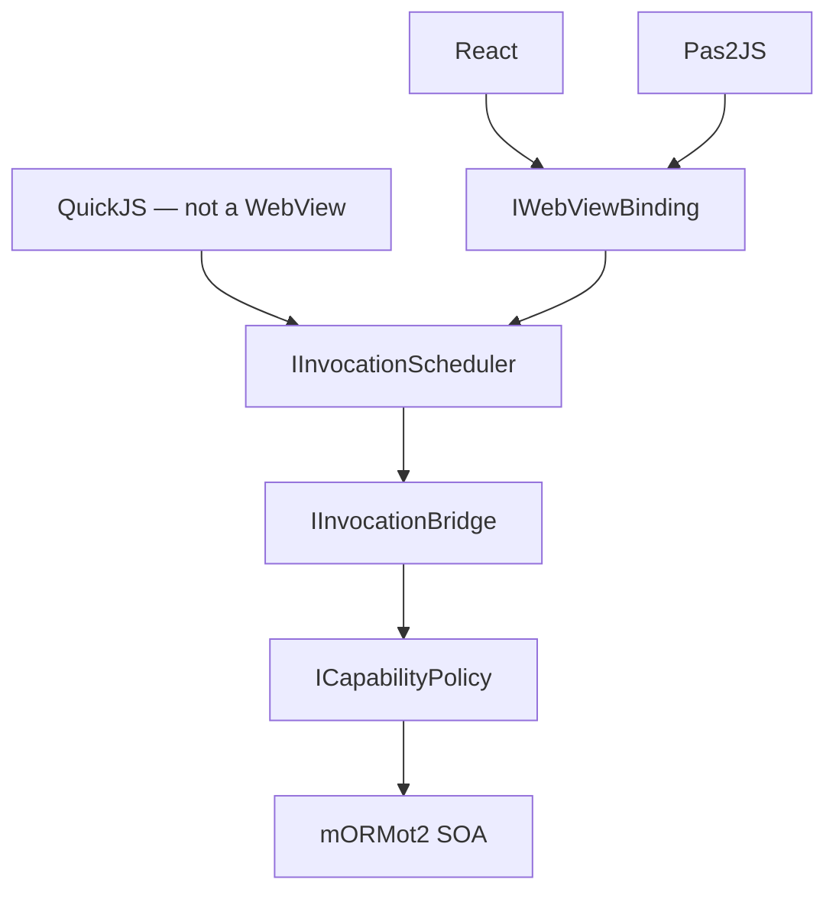

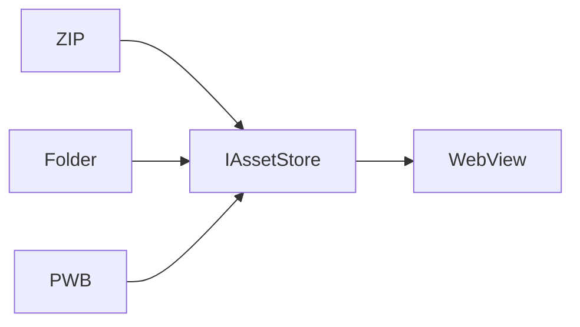

## Invocation path (CAP-3)

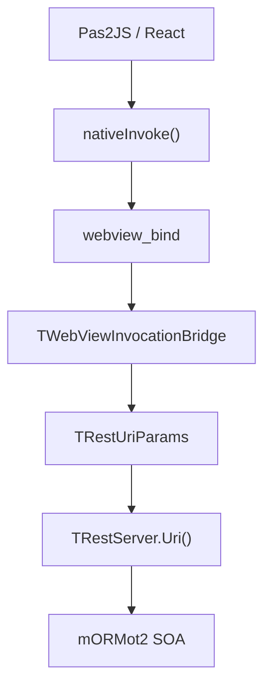

Explicitly absent from this path: `TRestHttpServer`, localhost, TCP, HTTP, any port.

## One RPC path for every frontend (CAP-5)

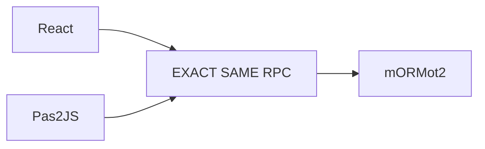

## Threading (invariant 1)

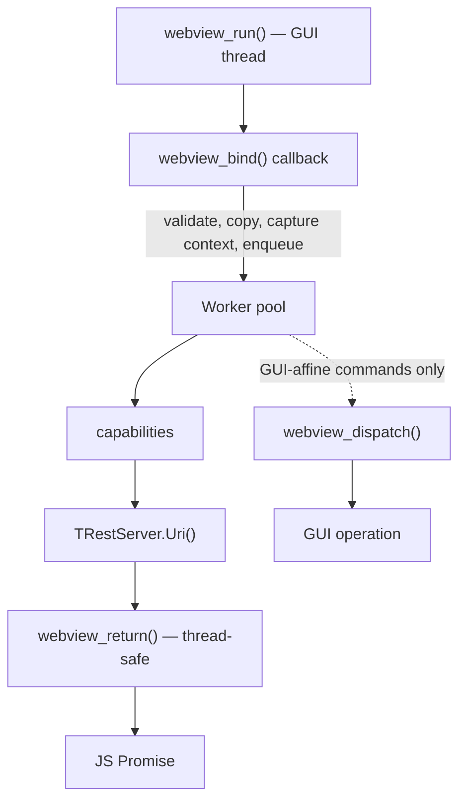

## Control plane vs data plane (CAP-12)

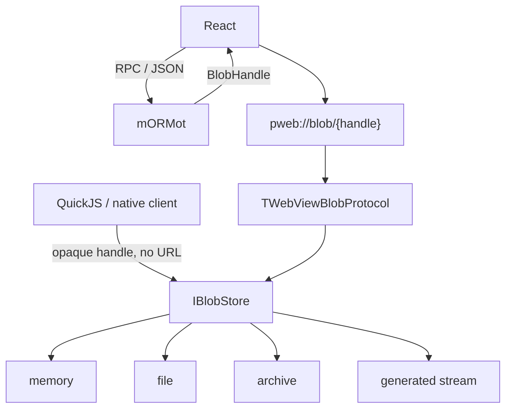

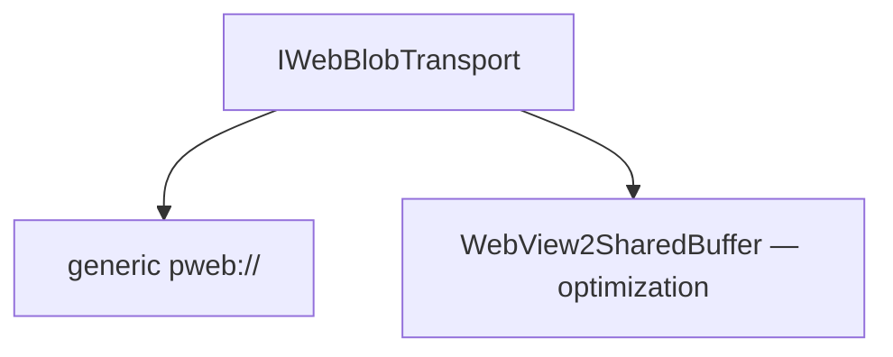

## Capability gating (CAP-8)

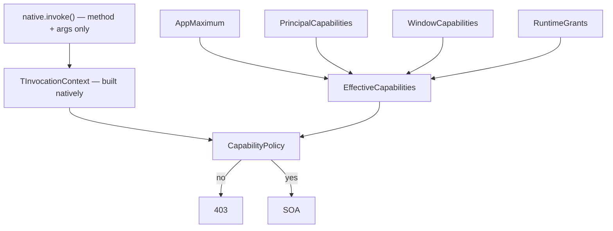

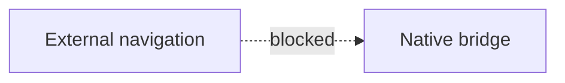

## QuickJS adds no new RPC architecture (CAP-9)

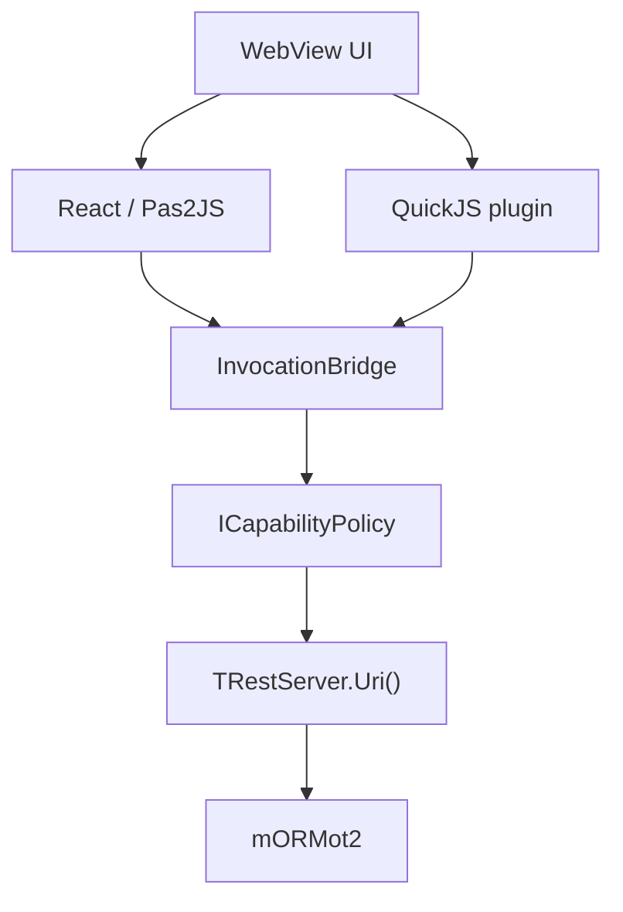

## Build pipeline (CAP-6, CAP-10)

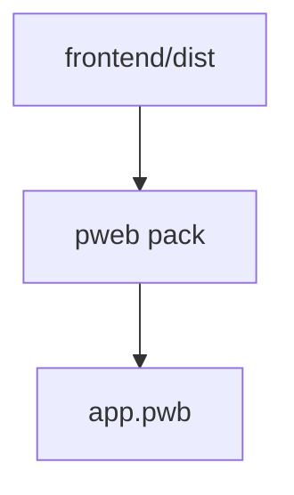

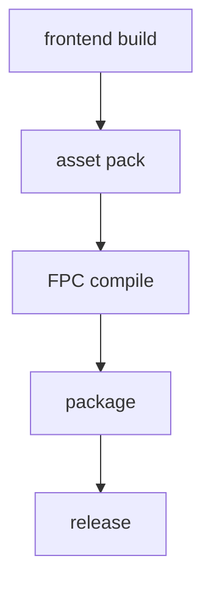

## Upstream watcher (CAP-11)

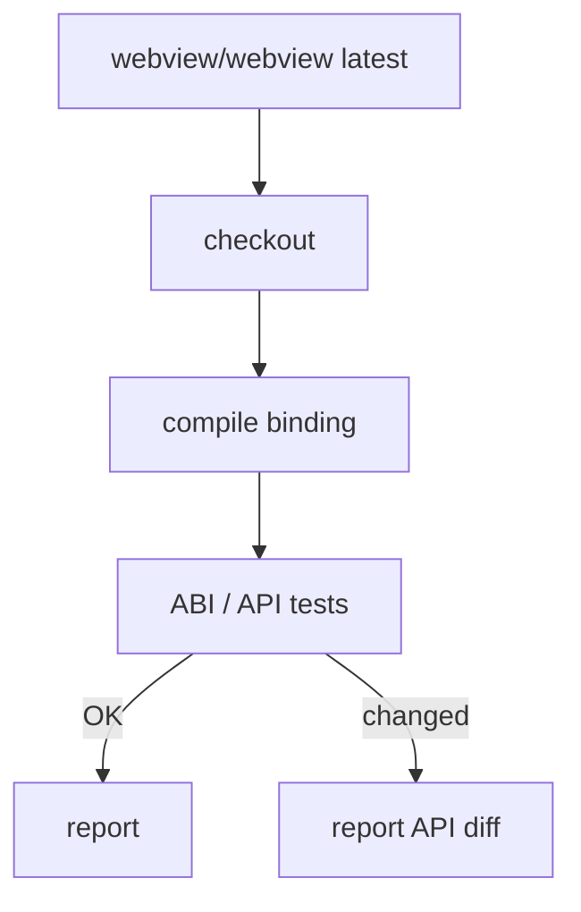

Production always builds against the pinned upstream version, never `master`.

## Critical path

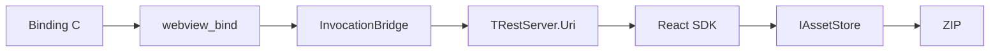
